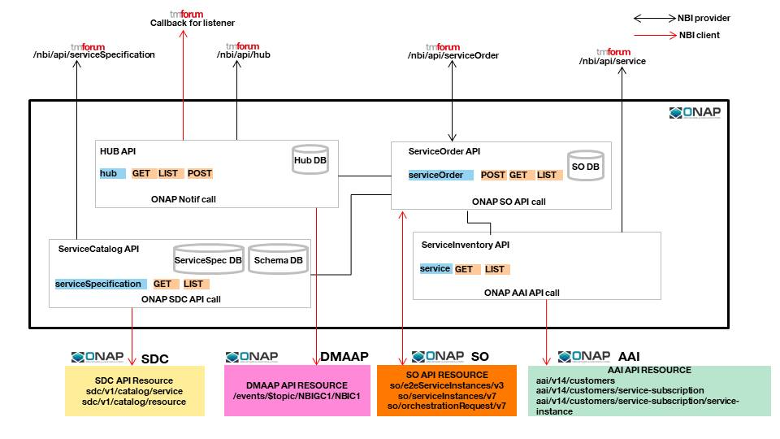

.. SPDX-License-Identifier: CC-BY-4.0
.. Copyright 2018 ORANGE
.. _architecture:

Architecture
============

************
Introduction
************

NBI stands for NorthBound Interface. It brings to ONAP a set of API that can be
used by external systems as BSS for example.
These API are based on **TMF API**.

*******************************************
Global NBI architecture for Guilin release
*******************************************

Following illustration provides a global view about NBI architecture,
integration with other ONAP components and API resource/operation provided.

***************
Developer Guide
***************

Technical information about NBI
(dependencies, configuration, running & testing)
could be found here: :doc:`NBI_Developer_Guide <NBI_Developer_Guide>`

