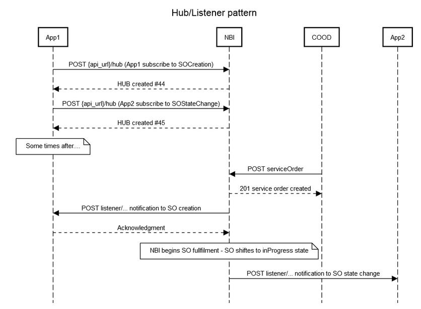

.. This work is licensed under a Creative Commons Attribution 4.0
   International License.
.. http://creativecommons.org/licenses/by/4.0
.. Copyright 2018 ORANGE
.. _offeredapis:

============
Offered APIs
============
************
Introduction
************

NBI stands for NorthBound Interface. It brings to ONAP a set of API that can
be used by external systems as BSS for example. These API are based on
**TMF API**.

*******************************************
Global NBI architecture for Honolulu release
*******************************************

Following illustration provides a global view about **NBI** architecture,
integration with other ONAP components and API resource/operation provided.

.. image:: ../images/onap_nbi_dublin.jpg
   :width: 800px

************
API Endpoint
************

Since Frankfurt, in an OOM ONAP deployment context:

https://nbi.api.simpledemo.onap.org:30274/nbi/api/v4

Locally, for dev and testing purpose:

http://localhost:8080/nbi/api/v4

***********
API Version
***********

APIs are described with a  state version with "v" following the API Name,
e.g.:  ``nbi/api/v4/productOrder``.
The schema associated with a REST API must have its version number aligned
with that of the REST API.

The version number has major, minor and revision numbers. E.g. v1.0.0
The version number (without the revision number) is held in the URI.

The major version number is incremented for an incompatible change.
The minor version number is incremented for a compatible change.
For minor modifications of the API, version numbering must not be updated,
provided the following  backward compatibility rules are respected:

- New elements in a data type must be optional (``minOccurs=0``)
- Changes in the cardinality of an attribute in a data type must be from
  mandatory to optional or from lower to greater
- New attributes defined in an element must be optional (absence of
  ``use="required"``).
- If new enumerated values are included, the former ones and its meaning must
  be kept.
- If new operations are added, the existing operations must be kept
- New parameters added to existing operations must be optional and existing
  parameters must be kept

For major modifications of the API, not backward compatible and forcing client
implementations to be changed, the version number must be updated.

*********
API Table
*********

.. |pdf-icon| image:: images/pdf.png
              :width: 40px

.. |swagger-icon| image:: images/swagger.png
                  :width: 40px

.. |swaggerUI-icon| image:: images/swaggerUI.png
                    :width: 40px

.. |html-icon| image:: images/html.png
               :width: 40px

.. |postman-icon| image:: images/postman.png
                  :width: 40px

.. csv-table::
   :header: "API", "|swagger-icon|", "|swagger-icon|", "|plantuml-icon|", "|xml-icon|"
   :widths: 10,5,5,5,5

   " ", "json file", "yaml file", "plant UML file", "xml schemas"
   "hub", ":download:`link <api_hub/swagger.json>`", ":download:`link <api_hub/swagger.yaml>`", ":download:`link <api_hub/api.plantuml>`", ":download:`link <api_hub/model.xsd>`"
   "serviceCatalog", ":download:`link <api_serviceCatalog/swagger.json>`", ":download:`link <api_serviceCatalog/swagger.yaml>`", ":download:`link <api_serviceCatalog/api.plantuml>`", ":download:`link <api_serviceCatalog/model.xsd>`"
   "serviceInventory", ":download:`link <api_serviceInventory/swagger.json>`", ":download:`link <api_serviceInventory/swagger.yaml>`", ":download:`link <api_serviceInventory/api.plantuml>`", ":download:`link <api_serviceInventory/model.xsd>`"
   "serviceOrder", ":download:`link <api_serviceOrder/swagger.json>`", ":download:`link <api_serviceOrder/swagger.yaml>`", ":download:`link <api_serviceOrder/api.plantuml>`", ":download:`link <api_serviceOrder/model.xsd>`"
   "status", ":download:`link <api_status/swagger.json>`", ":download:`link <api_status/swagger.yaml>`", ":download:`link <api_status/api.plantuml>`", ":download:`link <api_status/model.xsd>`"

***********************
API ReDoc Documentation
***********************

* :doc:`API hub <redoc/api_hub>`
* :doc:`Service Catalog <redoc/api_serviceCatalog>`
* :doc:`Service Inventory <redoc/api_serviceInventory>`
* :doc:`Service Order <redoc/api_serviceOrder>`
* :doc:`Status <redoc/api_status>`

***************
API Description
***************

--------------
serviceCatalog
--------------

This API is based from TMF633 serviceCatalog. Only high level information
is provided - Swagger is documented.

Only ``serviceSpecification`` resource is provided.
Information are retrieved in **SDC** (and in TOSCA file)

Only characteristics at service level will be retrieved in ONAP TOSCA file.
For example if an ONAP service is composed of VNF and the VF module, the
``serviceSpecification`` resource will only feature characteristic described in
the ONAP service TOSCA model and not attributes in the TOSCA files for VNF
or VF module.

Only *basic* service characteristics will be managed in this release. By
*basic* we mean string, boolean, integer parameter type and we do not manage
*map* or *list* parameter type.

**GET serviceSpecification(list)**

Example: ``GET /nbi/api/v4/serviceSpecification/
?category=NetworkService&distributionStatus=DISTRIBUTED``

It is possible to retrieve a list of ``serviceSpecification`` (get by list).

Only attributes ``category`` and ``distributionStatus`` are available for
``serviceSpecification`` filtering. It is possible to select retrieved
attributes using fields attribute.

If no ``serviceSpecification`` matches, an empty list is send back.

**GET service Specification (id)**

Example: ``GET /nbi/api/v4/serviceSpecification/{uuid}``

It is use to retrieve one ``serviceSpecification`` - all available information
are retrieved (see Swagger for description)

**GET service Specification Schema (id)**

Example:
``GET /nbi/api/v4/serviceSpecification/{uuid}/specificationInputSchema``

It is use to retrieve one  input schema from the tosca file stored in **NBI**
- all available information are retrieved (see Swagger for description)

**POST service Specification**

Example:

``POST /nbi/api/v4/serviceSpecification``

This operation creates a ``serviceSpecification`` in catalog (see Swagger for description)
It is used to provide a consistent way of on-boarding third party services to SDC via External API

Only *primitive type* service characteristics are supported as part of this release. Further enhancements
need to be made on other modules of ONAP for ensuring e2e automation of third party services. 

----------------
serviceInventory
----------------

This API is based from TMF638 serviceInventory. Only high level information
is provided - Swagger is documented.

This API retrieves service(s) in the **A&AI** inventory. Only following
attributes will be retrieve in service inventory: ``id``, ``name``, ``state``
and ``type``

**GET Service Inventory (list)**

Example: ``GET /nbi/api/v4/service/?relatedParty.id=Pontus``

GET (by list) allows to request with following criteria (all optional) :

*   ``id`` (id of the service instance) - id of the service instance
    (inventory)
*   ``serviceSpecification.id`` - id of the service specification (catalog)
*   ``serviceSpecification.name`` - name of the service specification (catalog)
*   ``relatedParty.id`` - id of the (**A&AI**) customer - if not filled we use
    *generic* customer

if no service matches, an empty list is send back.

1. If a request is send without any parameter, we'll retrieve the list of
   service-instance for the *generic* customer
2. If only customer parameter is filled (``relatedParty.id`` +
   role= relatedParty'ONAPcustomer') we'll retrieve the list of
   service-instance for this customer
3. If serviceSpecification.id or name is filled we'll retrieve the list of
   Service instance (from this service specification) - We'll use the customer
   id if provided (with Role='ONAPcustomer) or generic if no customer id
   provided

**GET Service Inventory (id)**

Example: ``GET /nbi/api/v4/service/{id}`` When querying for a specific service
instance id, no additional filters are required.

The Service Inventory API will retrieve the service instance data from A&AI
using the nodes query with the service instance id as the key.
``relatedParty.id`` + ``serviceSpecification.name`` are added to the response
based on the A&AI service instance url.

------------
serviceOrder
------------

This API is based from  TMF641 serviceOrder. Only high level information
is provided - Swagger is documented.

It is possible to use POST operation to create new ``serviceOrder`` in **NBI**
and triggers service provisioning. GET operation is also available to retrieve
one service order by providing id or a list of service order. For this release,
only a subset of criteria is available:

* ``externalId``
* ``state``
* ``description``
* ``orderDate.gt`` (orderDate must be greater - after -than)
* ``orderDate.lt`` (orderDate must be lower-before - than)
* ``fields`` - attribute used to filter retrieved attributes (if needed) and
  also for sorted SO
* ``offset`` and ``limit`` are used for pagination purpose

ServiceOrder will manage following ``actionItem`` action:

* ``add`` - a new service will be created
* ``delete`` - an existing service will be deleted
* ``change`` - an existing service will be deleted and then created with new
  attribute value

**Prerequisites & assumptions**

* Cloud & tenant information MUST BE defined in the external API property file
* Management of ONAP customer for add service action

With the current version of APIs used from **SO** and **A&AI** we need to
manage a *customer*. This customer concept is confusing with Customer BSS
concept. We took the following rules to manage the *customer* information:

* It could be provided through a ``serviceOrder`` in the service Order a
  ``relatedParty`` with role ``ONAPcustomer`` should be provided in the
  ``serviceOrder`` header (we will not consider in this release the party
  at item level). External API component will check if this customer exists
  and create it in **A&AI** if not.
* If no ``relatedParty`` is provided, the service will be affected to
  ``generic customer`` (dummy customer) - we assume this ``generic customer``
  always exists.
* Additionally **NBI** will create in **A&AI** the service-type if it did not
  exists for the customer

**ServiceOrder management in NBI will support 2 modes:**

* E2E integration - **NBI** calls **SO** API to perform an End-To-end
  integration
* Service-level only integration - **NBI** will trigger only **SO** request at
  serviceInstance level. **SO** prerequisite: **SO** must be able to find a
  BPMN to process service fulfillment (integrate VNF, VNF activation in
  **SDNC**, VF module

The choice of the mode is done in NBI depending on information retrieved in
**SDC**. If the serviceSpecification is within a Category "E2E Service" ,
**NBI** will use E2E **SO** API, if not only API at service instance level
will be used.

There is no difference or specific expectation in the service order API used
by **NBI** user.

**ServiceOrder tracking**

State management: States are only managed by ServiceOrder component and could
not be updated from north side via API.
Accordingly to service order item fulfillment progress, order item state are
updated. Order state is automatically updated based on item state.
Additionnally to this state, **NBI** provided a completion percent progress to
have detailled information about order progress.
Order Message are retrieved in the ``GET serviceOrder`` to provide **NBI** used
addtionnal information about ``serviceOrder`` management.

**Notification:**

It is possible for an external system to subscribe to service order
notifications. 3 events are managed:

* A new service order is created in **NBI**
* A service order state changes
* A service order item state changes

It is also possible to subscribe to **AAI** and **SDC** notifications via
**NBI**.
4 events are managed:

* A new service is created in  **AAI***
* A service attribute value is changed in **AAI**
* A service is removed in **AAI**
* A service specification is distributed in **SDC**

These 7 events have distinct notification allowing any system to subscribe to
one, two or all notification types.

The implementation will be split in 2 components:

* A HUB resource must be managed within the NBI/serviceOrder API. This HUB
  resource allows system to subscribe to **NBI** notification
* An Event API must be available at listener side in order to be able to
  receive Listener (when event occurs). **NBI** will be upgraded to use this
  API as client - **NBI** will shoot ``POST listener/``

The following diagram illustrates such notification flow:

**East-west interaction of ONAP instances through External API**

Operator's SO component will talk to service provider's external API component
through its own external API component.

External API support two methods of posting a Service Order or registering for
Hub.

1. If the incoming request is per current implementation (no additional headers
) then no changes will be made. The request will be serviced per BAU flow.
2. If the incoming request has additional *Target* header parameters, External
API will identify that the request has to be relayed to another ONAP instance
and route the request accordingly.

Target parameter: The public endpoint url for target ONAP instance's External
API, for instance
http://externalDomain/nbi/api/vX

* For posting service order and getting service order status, the request will
  be relayed to target (service provider's External API) as-is. These are
  synchronous requests and operator's External API will wait for response from
  the target and relay it back to original calling system (operator's SO).
* For Hub API, there is an additional step required. The listener from calling
  system (operator's SO) will be replaced with External APIs own listener.
  A mapping of registered subscriber and its original listener will be
  maintained in External API's DB. Operator's External API will relay the Hub
  API call to service provider's External API. The service provider's External
  API will register operator's External API as a listener.
* After SO processing in service provider's ONAP is completed (irrespective of
  status - reject, success, fail etc), service provider's External API will
  notify the operator's External API about request completion. Operator's
  External API will look-up for registered subscriber and its original listener
  (operator's SO) and relay the message.

Operator's Service Orchestrator will invoke its own External API component and
add SP Partner URL in the header. After receiving an acknowledgement for
Service Order request, the SO component will register with External API's hub
and provide its listener for processing callback events.

Technical information about **East-west interaction exercise** design
specification and API Flow illustration (with example messages) could be found
here:

https://wiki.onap.org/download/attachments/8227019/CCVPN%20Phase%202%20HLD.docx?api=v2

***************
Developer Guide
***************

Technical information about **NBI** (dependencies, configuration, running &
testing) could be found here:
:doc:`NBI_Developer_Guide <../architecture/NBI_Developer_Guide>`

API Flow illustration (with example messages) is described in this document:
:download:`nbicallflow.pdf <pdf/nbicallflow.pdf>`
